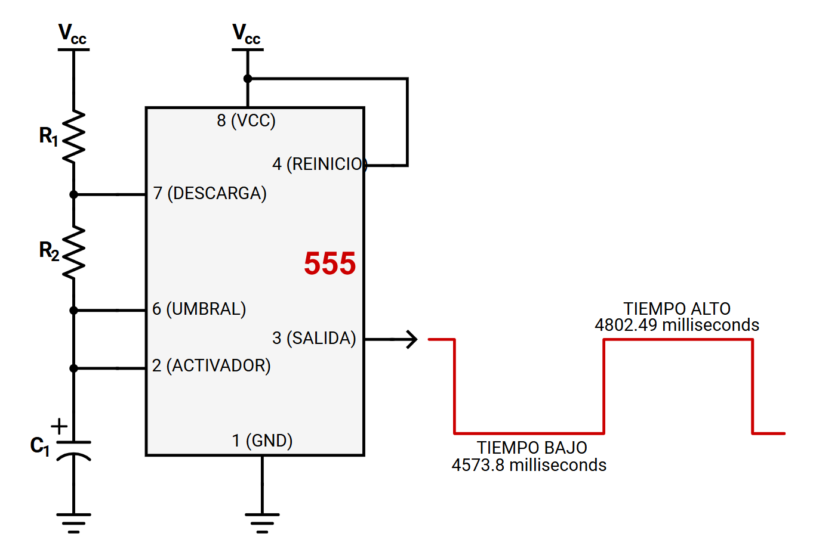
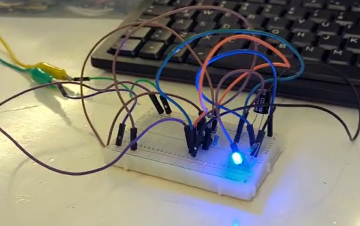

# 📚 Documentación de la Práctica – Temporizador 555 en modo Astable

> Proyecto académico de electrónica básica: implementación de un oscilador astable con el CI 555 para hacer parpadear un LED.  
> Los cálculos y simulaciones se realizaron en base a la configuración estándar del 555.

---

## 1) Resumen

- **Nombre del proyecto:** Oscilador Astable con 555  
- **Equipo / Autor(es):** Alessandro Reyes, Jose Góngora, Sebastián Cortez  
- **Curso / Asignatura:** Electrónica / Circuitos Digitales  
- **Fecha:** 05/09/2025 
- **Descripción breve:** Se diseñó un circuito con el temporizador 555 en modo astable para encender y apagar un LED cada 3–5 segundos, armado de forma física y documentado con evidencia en fotos y video.

!!! tip "Consejo"
    Este proyecto sirve como introducción al uso del 555 como generador de señales periódicas.

---

## 2) Objetivos

**General:** Implementar un circuito oscilador astable con el CI 555 para controlar el parpadeo de un LED.  

**Específicos:**
  - Diseñar el circuito con valores adecuados de resistencias y capacitores.  
  - Calcular teóricamente los tiempos alto y bajo de la señal.  
  - Verificar en la práctica el correcto parpadeo del LED.  
  - Comparar resultados teóricos y experimentales.  

---

## 3) Alcance y Exclusiones

**Incluye:**  
  - Implementación en protoboard del 555 en modo astable.  
  - LED parpadeando con periodo de 3–5 segundos.  
  - Documentación de cálculos y resultados.  
  - Evidencia en fotos y video.  

**No incluye:**  
  - Diseño de PCB.  
  - Simulación en software especializado.  
  - Implementación con microcontroladores.  

---

## 4) Requisitos

**Hardware**
- 1 × CI 555  
- 1 × Resistencia R1 = 1 kΩ  
- 1 × Resistencia R2 = 20 kΩ  
- 1 × Capacitor electrolítico C1 = 330 µF  
- 1 × LED + resistencia limitadora (330 Ω – 1 kΩ)  
- Fuente de alimentación (5–9 VDC)  
- Protoboard y cables  

**Conocimientos previos**
- Ley de Ohm y cálculo de resistencias  
- Funcionamiento del temporizador 555  
- Uso de protoboard y multímetro  

---

## 5) Procedimiento e Instalación

1. **Armar el circuito según el diagrama:**  

<em>Figura 1. Diagrama del temporizador 555 en modo astable</em>

2. **Cálculos teóricos:**  

<em>Figura 2. Cálculos teóricos del circuito</em>

3. **Observación práctica:** El LED permanece encendido ~4.8 s y apagado ~4.6 s, cumpliendo con el requisito (3–5 s).

---

## 6) Resultados

- ✅ LED parpadea dentro del rango esperado (aprox. 9.3 s de periodo total).  
- ✅ El comportamiento práctico coincide con las fórmulas.  
- ✅ El 555 demostró ser un generador confiable de pulsos de baja frecuencia.

**Fotos del montaje físico:**

<em>Figura 3. Montaje físico – Vista 1</em>

<em>Figura 4. Montaje físico – Vista 2</em>

---

## 7) Video de funcionamiento

<iframe src="https://iberopuebla-my.sharepoint.com/personal/203032_iberopuebla_mx/_layouts/15/embed.aspx?UniqueId=e8c189ab-aa52-465a-aa4a-13fa0318dfe7&embed=%7B%22ust%22%3Atrue%2C%22hv%22%3A%22CopyEmbedCode%22%7D&referrer=StreamWebApp&referrerScenario=EmbedDialog.Create" 
        width="800" height="450" frameborder="0" scrolling="no" allowfullscreen 
        title="555_astable_led.mp4"></iframe>

<em>Figura 3. Video del LED parpadeando</em>

🔗 <a href="https://iberopuebla-my.sharepoint.com/:v:/g/personal/203032_iberopuebla_mx/EauJwehSqlpGqkoT-gMY3-cBpmpjnn-NBrabArAr7KmixnDw?e=U3kxCP">Ver video en OneDrive</a>

