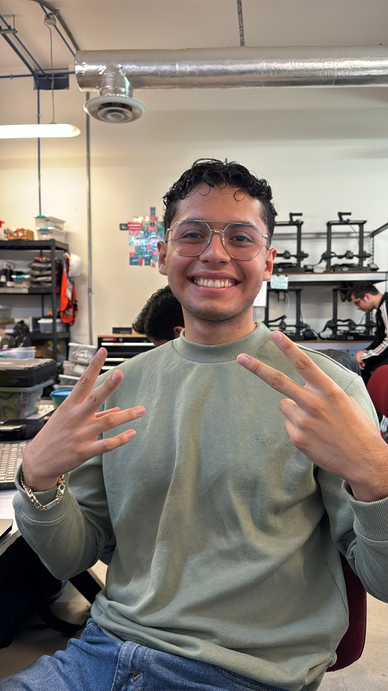
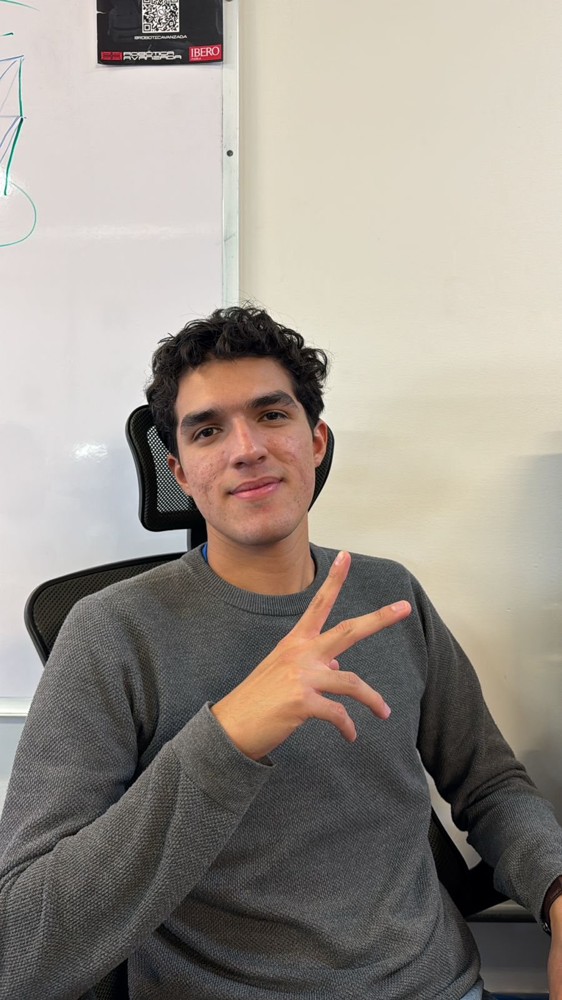

# Ingeniería Mecatrónica - Documentación
---
## José Manuel Compeán Góngora 

**Resumen:** 
Ingeniería Mecatrónica | [203609@iberopuebla.mx](203609@iberopuebla.mx)

Soy **José Manuel**, estudiante de **Ingeniería Mecatrónica**, apasionado por la tecnología, la programación y los sistemas electrónicos. Aprendo de manera práctica, aplicando conceptos matemáticos y técnicos a situaciones reales. He cursado Electrónica Analógica y Sistemas Digitales, y mi enfoque actual está en robótica, donde disfruto integrar sensado, control y actuadores con microcontroladores y lógica digital.

Me considero una **persona cercana, expresiva y curiosa**, con gusto por aprender de los demás y mejorar continuamente. Busco equilibrar lo académico con mi vida diaria, siendo empático con quienes me rodean y creciendo también en lo emocional.

El deporte y la actividad física son parte importante de mi vida porque me aportan disciplina y claridad mental. Sobre todo, me motiva seguir aprendiendo electrónica: desde el análisis de circuitos y el diseño de PCBs hasta la integración de hardware y software para resolver problemas reales.

## Jordi Alessandro Reyes Martínez

Ingeniería Mecatrónica | [jordi.reyes@iberopuebla.mx](jordi.reyes@iberopuebla.mx)

**Resumen:** Soy Alessandro Reyes, estudiante de Ingeniería Mecatrónica en la IBERO Puebla, apasionado por la ciencia, la innovación y los proyectos con impacto social. He desarrollado prototipos enfocados en inclusión y aprendizaje, como Infocélula y LumiBrain, que reflejan mi interés por combinar la tecnología con soluciones que transformen la vida de las personas.

Me defino como alguien curioso, creativo y proactivo, con experiencia en liderazgo de proyectos, trabajo comunitario en distintas regiones de México y participación en concursos académicos. Mi meta es crecer profesionalmente, vincularme con la industria automotriz en Alemania y dejar una huella positiva en cada reto que enfrento.
